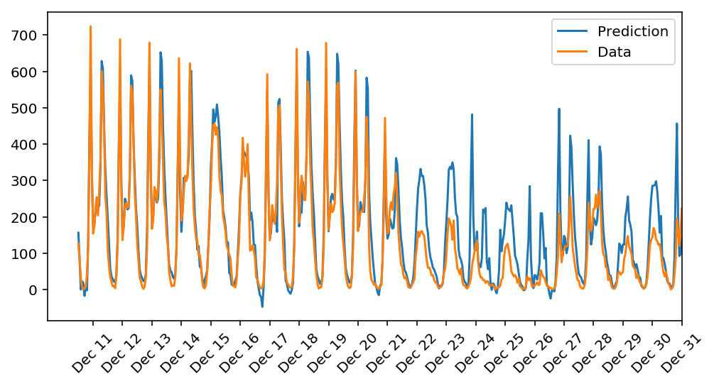

# bike sharing prediction

## usage

### setup

```sh
conda create --name dlnd python=3
```

### usage

```sh
source activate dlnd
pip install -r requirements.txt
jupyter notebook first_network.ipynb
```

## result

> Training loss: 0.305 ... Validation loss: 0.479


